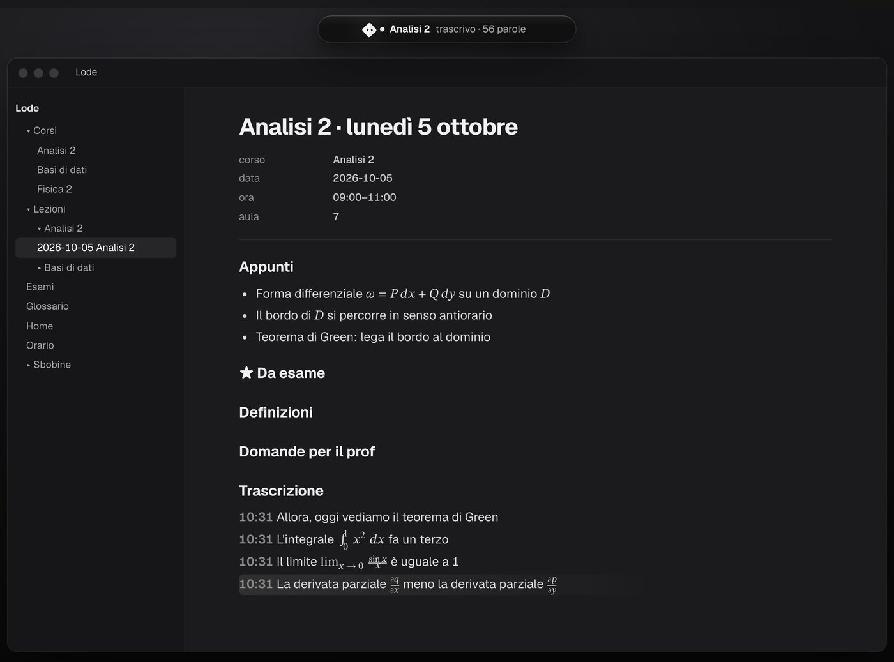
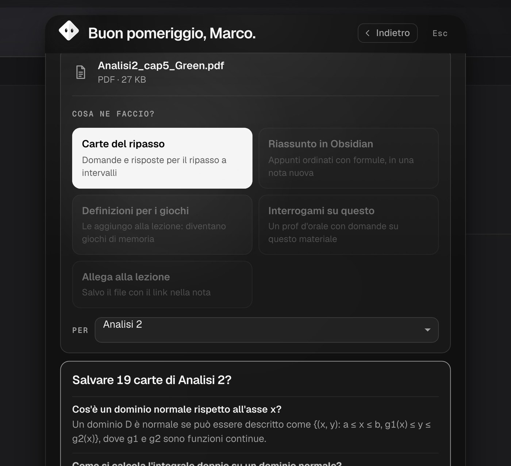
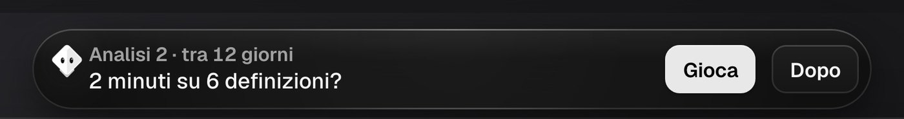
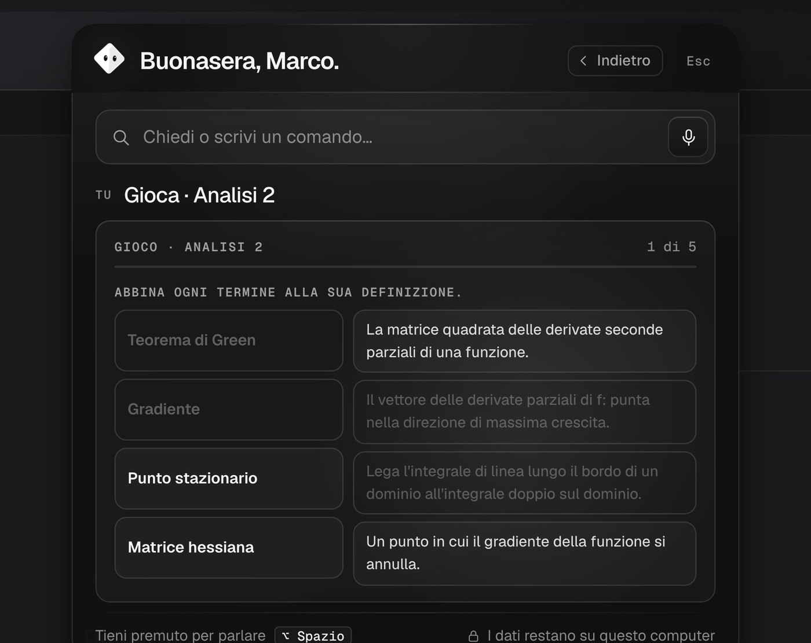

**English** · [Italiano](README.it.md)

# Lode

**The study assistant for university that lives at the top of your screen. Open source, free, in six languages. Your notes stay on your computer.**

Lode is a small pill of black glass at the top of your screen. While you're in class taking notes, it listens for you and helps you catch what you missed. At home it drills you on the things your professor actually said. Everything ends up in an [Obsidian](https://obsidian.md) vault that belongs to you: Markdown files you can read, fix and take with you.


> **Status: beta.** It's made for **Windows, macOS and Linux**, but so far it has only been tested thoroughly on a Mac with Apple silicon. All the Windows code is there (installing Obsidian and the AI, shortcuts, voice), but we haven't tried it on a real PC yet: if you do, [tell us how it went](https://github.com/W1kicartel/Lode/issues/new/choose) (first remove your name, keys and file paths from the message: the form reminds you).

**[Install Lode](#install)** on Windows, Mac or Linux: once, from the terminal, by copying a few commands. After that it opens from its icon like any other app and starts by itself when you turn on your computer.

---

## What it does

### In class
- **Repeat** (⌃⌥P). Missed a sentence? Lode keeps the last minute and a half in memory, only in RAM and never on disk, and when you ask it writes out the last 60 seconds, with the professor's last sentence highlighted. One click and it goes into your notes or among the “★ for the exam” items. In class it turns on by itself, if you enabled it once; if you turn it on yourself (with ⌃⌥P or from the panel) outside your timetable it stays on for 3 hours at most. When the microphone is on, the pill shows a dot.
- **Transcribes the whole lecture** (⌃⌥R) into the lecture's note in Obsidian, in chunks of 20-30 seconds: if the computer shuts down, what was there is already saved.
- **Formulas spoken aloud become formulas.** “the integral from zero to one of x squared dx” becomes $\int_{0}^{1} x^{2} \, dx$, and the same goes for limits, derivatives, sums, fractions and Greek letters. This works in English and Italian.
- **Quick capture** without leaving your notes: ⌃⌥S **★ For the exam**, ⌃⌥D **Definition**, ⌃⌥Q **Question for the professor**.
- **Knows when you're in class.** Write once “lecture calculus 2 monday and wednesday 9-11 room 7” and the pill shows `● Calculus 2 · ends in 23 min · ★2`.



### With files
Drag a file onto the pill, even when it's closed: it opens up and asks *what should I do with it?*

- **PDFs and slides (`.pptx`):** review cards, a summary in Obsidian, definitions for the games, a quiz, an attachment to the lecture.
- **Whiteboard photos:** turned into notes, formulas included.
- **Audio recordings:** transcribed into the lecture.
- **Notes (`.md`, `.txt`, `.docx`), classmates' lecture transcripts and Anki decks.**



### At home
- **The exam syllabus, topic by topic.** Paste the course syllabus (or drag the PDF) and Lode splits it into topics. For each one it looks at what you really have: notes, the professor's ★, cards, reviews, quizzes. You get a map, from “never touched” to “solid”, and a day-by-day plan up to the exam date. It starts with your weak topics and the ones that come up most often, and every new topic comes back after a few days. The day before the exam is for a general review and, if there's time, there's a buffer day for the unexpected. The plan is rebuilt every day from what you know. It works without AI; with AI it reads messy syllabi better and quizzes you topic by topic.
- **The plan for students who work.** Write your shifts once (“I work monday wednesday friday 2-7pm”) and Lode takes them out of your study hours, with half an hour for the commute, along with your lectures. On work days the plan stops at 2 hours (you can change that). “weekly plan” puts all your exams in a single calendar, in minutes rather than number of topics: “Mon 13 · about 1 h 45 free · work 14–19”. When it doesn't all fit, Lode says so, with the options next to it and how much time each one saves; you decide, with one click. At work the pill doesn't suggest anything. With no job and a single exam, the plan stays the syllabus plan.
- **Questions from past exams.** The ones going around your course's group chat: paste them (“past exam questions for calculus 2: …”, one per line). Lode puts them under their topic, counts them and moves the topics that come up most often higher in the plan. In the oral quiz, the professor asks similar ones.
- **Past papers, one a day.** The old exams going around your course's group chat: drag the PDF (choose “Past papers”) or paste them (“past papers for calculus 2: …”). Lode splits them into exercises using the markers it finds (“Exercise 1”, “Ex. 2”, “Problem 3”), lets you check the split and puts each exercise under its syllabus topic. Every day, in the plan, there's an exercise on today's topics: you do it on paper, without notes, and then you say how it went. Lode doesn't grade it and doesn't give fake marks: if you got it right it comes back in a week, if you got it wrong in 3 days, if you didn't know where to start in 2. You see the professor's solution, if the paper has one, only afterwards. The result updates the map. Without AI: it can't read a scanned PDF, so you paste the text yourself.
- **The mock exam.** “mock exam for calculus 2” (or the button under the past papers): a whole old exam, with the real time limit. Lode picks the most recent one you've never done in full, reads the duration from the paper (“Time: 2 hours”) or suggests 2 hours, and starts the timer in the pill. You see all the exercises in a row, without solutions; “Next one” records how long you spend on each. When you hand it in (or when time runs out) you say how each exercise went: right, half right, wrong, not done. If you started it by mistake, “Never mind” removes it without recording anything. Only after you hand it in do you see the professor's solutions. No grade: if the paper lists points, Lode adds up the ones you marked as right, and says clearly that you decided them. The results go back into the past papers and the syllabus map.
- **“Let me explain it to you.”** You explain a topic in your own words, written or spoken, as in an oral exam. Without AI, Lode checks the points it finds in the syllabus and in your notes and tells you which ones you skipped; with AI it gives you feedback as in an oral exam. Explaining in your own words is one of the study methods that work best, and the result updates the map.
- **Drills you when you have two minutes.** Tell it when your exam is (“the calculus 2 exam is on 15 January”). When you're at the computer and free, the pill stretches out and suggests something small: a game on definitions, cards to review, ★ to reread, three questions as in an oral exam. The closer the exam, the more often. Never in class or during your quiet hours. It learns what you need.
- **Memory games** on the definitions from your lectures: match, who am I?, fill in the blank, flash.
- **Spaced repetition** (SM-2): hard cards come back tomorrow, easy ones in weeks.
- **Your cards in Anki too.** Write “export to anki” (or “export my calculus 2 cards to anki”) and Lode prepares a file with your review cards and the definitions from your lectures, without duplicates: one deck per course (`Lode::Calculus 2`), with formulas, code and bold text. In the app the file goes into the `Anki` folder of your vault; in the browser it downloads. In Anki: **File › Import**, choose the file and **Basic** as the note type, once for all courses. If you import it again, Anki updates the cards it already has instead of doubling them.
- **Review in your pocket.** Write “pocket review” and Lode puts tomorrow's cards (20 at most, overdue ones first) in a note in your vault. On your phone you open it in Obsidian: tap “Answer” to see it and tick “knew it” or “didn't know”. When the note comes back to the computer, Lode records the review and rewrites it with the new cards. With “pocket review every evening” it rewrites it by itself after 7 pm. Lode doesn't use the network: the note travels with the service you already use (iCloud, Obsidian Sync, Syncthing). If an old copy of the note arrives, Lode records nothing: never the same card twice. Desktop app only.
- **“I want to…”, step by step.** Write “I want to make a website”, “how do I edit a video” or “help me write my thesis”. Lode looks for the apps you need on your computer and shows them to you: they open only when you choose them. Then it guides you one step at a time (“Done, next”, “I can’t do it”, “Back”, “Stop”) until the end. Your AI writes the plan, if you have one; otherwise Lode has its own recipes for theses, websites, programs, presentations, videos, data and exams. The list of steps stays in the vault and “resume the guide” picks up where you left off. In coding steps, if you have Claude Code, “Do it with Claude Code” opens a real terminal in the folder you choose, with the text you confirmed: it uses your subscription, no key.
- **Oral quiz:** an oral-exam professor who asks one question at a time, corrects you and at the end gives you an honest grade.
- **Grades and maths:** weighted average, “what do I need for 110”, “what if I get 30 in calculus”, hours to study today to be ready for the exam. In the Italian system also the *base di laurea*, the starting point of the final degree mark. Lode supports the grading systems of Italy, Spain, France, Germany, Portugal, Brazil, the United Kingdom and the United States: see [Languages](#languages).
- **Lecture transcripts to pass to classmates:** an `.md` for Obsidian and an `.html` page that opens on any phone, with the formulas rendered.





### If you don't attend (working students, online universities, recorded lectures)
- **Lecture from the computer.** Start the video lecture wherever you watch it (your university's platform, an online university, Teams, Zoom, a recording) and write “transcribe the video lecture of private law”: Lode listens to the audio coming out of the computer and writes it into the lecture's note, formulas included, just like in class. It doesn't download the video, doesn't log into the platform and doesn't ask for accounts: it hears what you hear. The audio stays in memory only for the time it takes to transcribe it. On the Mac (from macOS 14.2) the first time, the system asks for permission to record system audio, not the screen: Lode compiles from source by itself, in a few seconds, the small program that listens (`desktop/ascolta-mac`). On Windows and Linux nothing is needed. If it hears nothing after 25 seconds, it tells you. Lectures belong to the lecturers: the transcript is for your own study, don't share it if your university's rules don't allow it.
- **Your university's Moodle.** “connect moodle”: write the address of your course platform (many universities run Moodle under their own name) and log in as in the official Moodle app, with your university login (including single sign-on, such as Italy's SPID) in a Lode window, or with username and password. Choose which courses to follow: new files (slides, handouts, exercises) arrive in Lode as if you had dragged them in, with the course already chosen, and the pill tells you when there are some. “deadlines” shows the assignments due in the next few weeks, and “syllabus for …” can take the syllabus from the course description. Read only: Lode doesn't submit or write anything. The connection stays encrypted on this computer (never in the vault, never online) and the password isn't saved. Online universities often have their own platforms with no access for apps: there, use “Lecture from the computer”.
- **Multiple-choice quiz.** “quiz on calculus 2”, or drag the handout and choose “Multiple-choice quiz”. Four answers, one right, as in a written exam. There are two modes: **practice** (10 questions, corrected right away with the explanation) and **exam simulation** (usually 30 questions in 30 minutes, as at Italian online universities, with the clock running, the correction at the end and a grade out of 30). Without AI the questions come from your cards and definitions, and the wrong answers are taken from other cards of the course. With AI they come from the handout: the model has to copy the sentence that proves the right answer, and the question is kept only if that sentence really is there. Wrong answers become review cards with one click, and the result updates the syllabus map.

### Talk the way you talk
No commands to learn. Type, or hold ⌥ Space (Ctrl+Shift+Space on Windows) and speak:

```
I got 28 in physics 2
exam databases on 15 January 9 credits
what do I need for 110
def: gradient = vector of partial derivatives
repeat
transcribe the lecture
quiz me on calculus 2
explain Green's theorem
export to anki
pocket review
I work monday wednesday friday 2-7pm
weekly plan
```

The bar understands sentences like these in English, Italian, Spanish, French, German and Portuguese. The grades here are on the Italian scale (pass 18, top 30, degree mark out of 110): see [Languages](#languages).

### If you study computer science
For Programming courses and labs. No AI: the answers are computed by the computer, and Lode doesn't write code for you.

- **“What does it print?”** Five one-minute questions on small programs in C, Java or Python: loops, integer division, `%` with negative numbers, `i++` and `++i`, switch without break, pointers, recursion. It takes the language from the course name (“Programming in Python”, “Java Fundamentals”; if it can't tell, C) or you say it: “what does it print in python”, “what does it print in java”. In each language you only get programs that can be written faithfully (pointers stay in C, fall-through switch and do-while don't go to Python) and the answer follows the real rules of the language: in Python `-7 // 2` is -4. Lode computes the right answer, and in our tests we compare it with a real compiler (and with python3 and javac) on hundreds of programs. The wrong answers are the typical mistakes, and if you pick one it tells you which: “that's what it would print with `i <= 4`”. If you have a programming course, a **Code** button appears too, and every so often the pill suggests it.
- **“Follow project”.** Choose your lab folder. Lode tells you what really changed, file by file, with the new functions, and whether you tested it after the last change. This holds even if the code was written by Claude Code, Codex or copy-paste: Lode doesn't know who wrote the lines, and says so. Lode doesn't write in your folder: it keeps the versions in its own. The commands you confirm (for example make) and your program do write, as from the terminal.
- **Tests in one click.** Lode compiles and runs the `.in`/`.out` tests it finds in the folder. It shows you the exact command first, and runs it only after you say yes in a system dialog. It isn't a sandbox: the program runs on your computer, as from the terminal. If the compiler is missing it tells you and explains how to install it, but it doesn't download anything by itself.
- **Errors in plain words.** “**lista.c, line 42**: you use `nodo` but it isn't declared”, with your line underneath and three steps to open one at a time: where to look, what it means and, only for mechanical errors, the fix. In projects marked “graded” there's no fix (and while you follow one, not even for copied errors). It also works without following a project: copy the error from the terminal, from Code::Blocks or from Dev-C++ and write “explain the error”.
- **The bridge with agents.** Write “agents” and connect the one you use: **Claude Code, Codex CLI, Gemini CLI, Cursor, GitHub Copilot CLI, Windsurf, Qwen Code, OpenCode, Kilo Code, Aider**. The agent sends Lode, on this computer, what it does in the projects you follow: files touched, commands, end of turn. At the end of a turn the pill tells you what it really did and warns you if **it says the tests pass but it didn't rerun them after the last change**, or if **it changed the tests while they were failing**. Read only: Lode doesn't reply to agents, doesn't decide anything and doesn't widen their permissions. Before writing into their configuration it shows you the exact lines in a system dialog; it keeps a copy of the file as it was (`.prima-di-lode`) and “disconnect” removes only its own lines. Events outside the projects you follow are thrown away, and what you write to the agent isn't saved. These are estimates from fixed rules: if they find nothing, that's not a guarantee. For now Kiro, Amp, Cline and Junie aren't there (formats not stable yet or not verified), nor Zed and Roo Code, which have no hooks.
- **New things.** When a line added in a project you follow uses a standard library function that wasn't in that file before (`realloc`, `strtok`, `computeIfAbsent`, `enumerate`…), the agent's turn card and “Done. In plain words” tell you, with file and line. Lode looks at the whole file, up to 2000 lines; in longer files only the lines near the change. For each one there's the question they'd ask you at the oral exam, with the answer: “Add it to my review” turns it into a card, “I already know it” never suggests it again. The dictionary is fixed and written by hand, about 60 entries across C, Java and Python: no AI, and Lode only sees names, not ideas.
- **Ready for the discussion.** “prepare me for the discussion of lab3” gives you the list of functions changed since you started following the project. First the ones changed while an agent was working and that you've never explained, then the others: “Explained: 5 of 12”. With “Let's try” Lode shows you only the signature and the line, and you explain it in writing as at the project discussion: what it takes, what it returns, how it works. Then it tells you what you said and what you skipped (the parameters, the return value, a loop, recursion, a library function like `malloc`), and only then shows you the code. No AI: the code finds the points, roughly, and doesn't judge whether the explanation is right. “Changed while the agent was working” is an estimate: it means the file changed during one of its turns, not who wrote the lines, which Lode doesn't know. Only function names are saved, never the code, and the day's diary says “Explained: 7 of 12” with the names to go over; with the diary off nothing is saved.
- **The log in your vault.** The project diary (one note per project per day), the “What I really know” table on the course page and the errors you make most often. It's a log for you, not evidence for your professor: you can edit it or turn it off, and nothing leaves your computer.

What's allowed with agents and with AI is up to your course: ask your lecturer. On Windows you need a C compiler (MSYS2 or WinLibs): so far we've only tested it on the Mac. On Windows, while Lode follows a folder, you can't rename or move it: first write “stop following”.

```
what does it print
what does it print in python
follow project
what changed
tested?
test the project
explain the error
project diary
don't write the project diary for lab3
prepare me for the discussion of lab3
stop following lab3
```

## Languages

Lode speaks six languages: **English, Italiano, Español, Français, Deutsch, Português**. The language changes the text of the bar, the page and the welcome, the commands the bar understands without AI, dates and numbers, and the language the AI answers in. If a translation is missing, you see the Italian text (Lode was born in Italian).

- **Choosing it:** in the welcome (it's the first question), from the bar (“language italian”, “lingua inglese”, “idioma español”…) or in Settings. At first Lode uses your system language, if it knows it; otherwise English.
- **Your vault.** A new vault is created with folder and note names in the language you chose; an existing vault keeps its own.
- **Voice** understands all six languages. Spoken formulas become formulas in English and Italian; in the other languages the text stays as it is.
- **Language isn't country.** The grading system is chosen separately: an Italian student on Erasmus in Madrid can have the bar in Italian and Spanish grades.

| System | Grades | Pass | Credits | Final result |
|---|---|---|---|---|
| Italy | 18–30, and 30 *e lode* (with honours: hence the name) | 18 | CFU | *base di laurea* = average × 110 / 30 |
| Spain | 0–10 | 5 | ECTS | weighted average 0–10 |
| France | 0–20 | 10 | ECTS | *moyenne* 0–20 with *mention* |
| Germany | 1.0–5.0 (lower is better) | 4.0 | ECTS | *Gesamtnote* 1.0–4.0 |
| Portugal | 0–20 | 10 | ECTS | *média final* 0–20 |
| Brazil | 0–10 | usually 6 (depends on the university) | *créditos* | average 0–10 |
| United Kingdom | 0–100 % | 40 | credits | degree class (First, 2:1, 2:2, Third) |
| United States | A–F | D | credit hours | GPA 0–4.0 |

The weighted average, “what do I need for …” and “what if I get …” follow the system you chose. Pasting your transcript works with Esse3 (the student portal of many Italian universities) and, for the other systems, with a plain table (name · credits · grade).

How it works inside and how to add a language: [docs/LINGUE.md](docs/LINGUE.md) (in Italian) and [CONTRIBUTING.md](CONTRIBUTING.md#in-english).

---

## Installation

### Install

For now Lode is installed from source: downloadable installers will come once they're signed with a certificate ([why](#the-installers-not-signed-yet)). You don't need to know how to code. You open the terminal once, copy the commands for your system and Lode takes care of the rest. This way the system doesn't block anything: Node.js, Electron, Obsidian and Ollama are signed by their authors.

You need about **5 GB free** (Obsidian about 300 MB, the local AI about 3.5 GB, voice between 200 and 640 MB) and 15-30 minutes, almost all of it downloading. The commands put Lode in the `Lode` folder inside your user folder.

Choose your system: **[Windows](#windows)** · **[Mac](#mac)** · **[Linux](#linux)**.

On first launch Lode asks your name and with one click installs Obsidian, the local AI and voice (on Linux not the local AI: install Ollama first, as the Linux section explains). Then it creates its **icon**:
- **Mac:** in **Applications** (the one in your user folder); you can also find it with Spotlight;
- **Windows:** in the **Start menu** and on the **desktop**;
- **Linux:** in the **applications menu**.

From there you reopen it like any other app, and it starts by itself when you turn on the computer: you don't need the terminal any more. The icon and start at login can be removed from the menu of Lode's icon. On the Mac, when Lode turns on start at login, macOS shows the “Background Items Added” notification: that's Lode.

Lode lives in the menu bar (Mac) or the notification area (Windows): don't look for it in the Dock. It's the black pill at the top of the screen: it opens with a click, or by holding **⌥ Space** on the Mac and **Ctrl+Shift+Space** on Windows and Linux.

**Updating.** Installed from source, Lode doesn't update by itself. Every so often quit it (menu of its icon › Quit Lode) and in the terminal type:
- **Mac and Linux:** `cd ~/Lode && git pull && cd desktop && npm install`
- **Windows** (PowerShell): `cd ~\Lode; git pull; cd desktop; npm.cmd install`

Then reopen it from the icon. On the Mac, if you had compiled the voice for the Neural Engine, also rerun `bash ~/Lode/desktop/voce-mac/compila.sh`.

### Windows

**What you need:** 64-bit Windows 10 or 11, at least 8 GB of memory (16 GB recommended for the local AI).

1. **Open PowerShell.** Windows key, type “PowerShell”, Enter. Open it normally, not “as administrator”.

2. **Install Node.js and Git** (once):
   ```powershell
   winget install OpenJS.NodeJS.LTS
   ```
   ```powershell
   winget install Git.Git
   ```
   The first time, winget asks you to accept its terms: type **Y** and Enter. Windows also asks for permission to install Node.js and Git: say yes. Then **close and reopen PowerShell**, so it sees the new programs. If `winget` isn't there, download them by hand from [nodejs.org](https://nodejs.org) (the “LTS” version) and [git-scm.com](https://git-scm.com/download/win).

3. **Download Lode and start it** (copy the whole line; `npm install` downloads a few hundred MB and takes a few minutes):
   ```powershell
   cd ~; git clone https://github.com/W1kicartel/Lode.git; cd Lode\desktop; npm.cmd install; npm.cmd start
   ```

4. **The guided setup** opens by itself. It asks your name and with one click installs **Obsidian**, the **local AI** (Ollama + Qwen3.5) and **voice** (Parakeet, or Whisper if the computer has less than 6 GB of memory). The vault with your notes is created in `Documents\Lode`. The pill appears at the top of the screen; Lode's icon is near the clock, in the notification area.

5. **The microphone.** If voice hears nothing: *Settings → Privacy & security → Microphone* and turn on “Let desktop apps access your microphone”.

**What's different on Windows:**

| | Windows |
|---|---|
| Voice, Repeat, transcription | **Parakeet v3** on the processor (with [sherpa-onnx](https://github.com/k2-fsa/sherpa-onnx)), if the computer has at least 6 GB of memory; otherwise **Whisper** (base or small), inside the app. See [The voice](#the-voice). |
| Shortcuts | **Ctrl+Shift+Space** held down to speak. Then Ctrl+Alt+P Repeat, Ctrl+Alt+R transcribe, Ctrl+Alt+S/D/Q capture. |
| Local AI | Works well with an NVIDIA or AMD graphics card. Without a graphics card it still works, but it's slow: cards from a PDF can take a few minutes (meanwhile you can close the panel and carry on). If the computer is weak, you can connect your own AI (see below). |
| Sharing a lecture transcript | Lode opens the folder with the files, to send however you like (WhatsApp Web, Drive, email). On the Mac there's the Share menu. |

**If something goes wrong on Windows:**
- **`npm` says “cannot be loaded because running scripts is disabled on this system”:** PowerShell is blocking scripts. Once:
  ```powershell
  Set-ExecutionPolicy -Scope CurrentUser RemoteSigned
  ```
  or use `npm.cmd install` and `npm.cmd start`.
- **The pill doesn't respond to shortcuts:** another program uses the same key combinations (for example some graphics card or keyboard utilities). Close it, or use the pill with the mouse.
- **Windows Defender asks for permission** for Ollama or Obsidian: they're the official installers, downloaded from their websites.

### Mac

**What you need:** macOS with Apple silicon (M1 or later) and at least 8 GB of memory. It also works on Intel Macs: in the downloaded app with Whisper instead of Parakeet, from source with Parakeet on the processor.

1. **Apple's tools.** You need them for git and for the Parakeet voice. Open Terminal and type:
   ```bash
   xcode-select --install
   ```
   A window opens: press **Install**. If it says they're already installed, that's fine.

2. **Node.js.** Download the “LTS” version from [nodejs.org](https://nodejs.org) and install it.

3. **Download Lode and start it** (copy the whole line; `npm install` downloads a few hundred MB and takes a few minutes):
   ```bash
   cd ~ && git clone https://github.com/W1kicartel/Lode.git && cd Lode/desktop && npm install && npm start
   ```

4. **The guided setup** opens by itself:
   - **Required.** Your name, then one click installs **Obsidian** (the official installer, with its signature verified), the **local AI** (Ollama + Qwen3.5, chosen according to the computer's memory) and **voice**. Downloads keep going while you move on.
   - **Optional, the quick setup.** University and course, your **transcript of records** pasted from Esse3 (the portal of many Italian universities; read even without AI) or as a plain table, exams with their dates, your **timetable** (in words, pasted from the website or from an `.ics` calendar), when you study and how often Lode may suggest things.

   The pill appears at the top of the screen. The Obsidian vault is in `Documents/Lode`. Need the setup again? From the icon's menu: “Redo the setup…”.

5. **The microphone.** The first time you use voice, Repeat or transcription, macOS asks for permission: allow it. If you started Lode from Terminal it asks for Terminal; if you opened it from the icon it may ask for “Electron”, the program Lode runs on. If you denied it, turn it back on in *System Settings → Privacy & Security → Microphone*.

6. **The best voice (recommended, Macs with Apple silicon).** Lode starts with Parakeet on the processor (sherpa-onnx, the same voice as Windows and Linux). On the Neural Engine it's faster: quit Lode (menu of its icon › Quit Lode) and compile `lode-voce`, which takes 3-5 minutes the first time:
   ```bash
   bash ~/Lode/desktop/voce-mac/compila.sh
   ```
   Then reopen Lode from the icon.

**If something goes wrong on the Mac:**
- **`npm install` gives `EACCES`:** npm's cache folder belongs to root (an old npm bug). Fix it with:
  ```bash
  sudo chown -R $(id -u):$(id -g) ~/.npm
  ```
- **`compila.sh` stops with errors about `PackageDescription` or `SwiftBridging`:** these are two known bugs in Apple's Command Line Tools 16.4. The script works around them by itself. If it still fails, update Apple's tools (step 1) and try again.
- **The first transcription with Parakeet takes about 45 seconds:** the Mac is preparing the model for the Neural Engine. It happens only once.

### Linux

**What you need:** a recent 64-bit distribution, Node.js 20 or later and git (from your package manager).

1. **Ollama** on Linux is installed with the official script, from [ollama.com/download/linux](https://ollama.com/download/linux). Lode installs Obsidian (AppImage) and the model by itself.
2. **Download Lode and start it** (copy the whole line):
   ```bash
   cd ~ && git clone https://github.com/W1kicartel/Lode.git && cd Lode/desktop && npm install && npm start
   ```
   If it stops with “The SUID sandbox helper binary was found, but is not configured correctly” (this happens on some distributions, for example Ubuntu 24.04), start it with `npm start -- --no-sandbox`: the icon Lode creates remembers it.
3. Voice is Parakeet on the processor (Whisper with less than 6 GB of memory) and the shortcuts are the same as on Windows. Transparent windows and global shortcuts depend on the desktop (GNOME, KDE…): on Wayland some may not work. Tell us how it went.

### The installers (not signed yet)

On the **[Releases](https://github.com/W1kicartel/Lode/releases/latest)** page there are already installers for Mac (`.dmg`), Windows (`.exe`) and Linux (`.AppImage`). They aren't signed with a certificate yet (Apple costs $99 a year; Windows needs a signing service, see [docs/FIRMA.md](docs/FIRMA.md)), so macOS and Windows block them the first time you open them and ask you to confirm by hand. Once they're signed they'll be the easiest way again, and they'll update by themselves.

**Warning:** the **0.5.0** installers don't open: two sync files were missing from the package (already fixed in the code). Until the next installers, signed, install Lode from source.

<details>
<summary>Using them anyway</summary>

**Check that it's the real one.** Download Lode only from the Releases page of this repository: a “Lode” passed around in a group chat or taken from another site can look the same and be something else. Next to each file GitHub shows its SHA-256 fingerprint (`sha256:…`); from the versions after 0.3.0 the same fingerprints are also in the Release's `SHA256SUMS.txt` file. Before opening it, compute the fingerprint of the file you downloaded and compare them: they must have the same letters and digits (Windows writes them in upper case). If they're different, don't open it.

- **Mac** (Terminal): `shasum -a 256 ~/Downloads/Lode-*.dmg`
- **Windows** (PowerShell): `Get-FileHash $HOME\Downloads\Lode-*.exe`
- **Linux**: `sha256sum Lode-*.AppImage`, in the folder where you downloaded it

The installers aren't signed with a paid certificate (it costs money every year and Lode is free), so **the first time** the system asks for confirmation:

| | Download | First launch |
|---|---|---|
| **Mac** (Apple silicon and Intel) | `Lode-…-mac.dmg` | Open the `.dmg` and drag Lode into **Applications**. Open it: the Mac says it can't verify it, press **Done**. Then go to **System Settings › Privacy & Security**, scroll to the bottom and press **Open Anyway** next to “Lode”. Only needed the first time. |
| **Windows** 10 and 11 | `Lode-…-windows.exe` | Open it. If “Windows protected your PC” appears, press **More info**, then **Run anyway**. It installs for your user, without administrator rights, and starts by itself. |
| **Linux** (64-bit) | `Lode-…-linux.AppImage` | Make it executable (right click › Properties › “Allow executing file as program”, or `chmod +x Lode-*.AppImage`) and open it. On Linux the local AI doesn't install by itself: first install Ollama with the script from [ollama.com](https://ollama.com/download/linux). |

**Updates.** On Windows and Linux (AppImage) Lode updates by itself: it downloads the new version in the background and “Lode X.Y.Z is ready” appears in “Today” with **Restart now**; if you don't press anything, it installs when you quit Lode. On the Mac, until the app is signed with an Apple certificate, the bar tells you a new version is out and **Download** opens the `.dmg`: you drag it into Applications like the first time. They can be turned off from “Prepare Lode” or from the icon's menu. Updates exist from the versions after 0.3.0: if you have 0.3.0 or earlier, download the new one by hand, once.

</details>

### For everyone

**How fast the local AI is.** It depends on the computer. On a Mac with 8 GB, Qwen3.5 4B writes about 20 words per second and cards from a PDF arrive in about half a minute. On a laptop without a graphics card it takes longer.

**Updating:** see [Install](#install).

**Uninstalling.** From the menu of Lode's icon untick “Start Lode at login” and Lode's icon, then quit and delete the `Lode` folder. Your notes stay in `Documents/Lode`: they're yours. Obsidian and Ollama are normal programs and are uninstalled like any other. The model is removed with `ollama rm qwen3.5:4b`.

**Just in the browser, without installing.** To try grades, maths, timer, reviews and games, from the `Lode` folder:
```bash
npx --yes http-server@14.1.1 -a 127.0.0.1 -p 5173
```
(`-a 127.0.0.1`: only this computer sees it, not whoever is on your Wi-Fi; `@14.1.1`: always the same version, not the latest published) then open http://localhost:5173: follow the setup or, to see it full in a moment, press “Example” in the bar. Voice, transcription, Repeat, Obsidian and the local AI are only in the app.

## AI: free by default, more with your own key

**Nothing to pay.** The local AI (Ollama + Qwen3.5) runs on your computer, free and offline: your notes don't leave it. Lode chooses the model according to memory:

| Computer memory | Model |
|---|---|
| up to 15 GB | Qwen3.5 4B |
| from 16 GB | Qwen3.5 9B |
| from 40 GB | Qwen3.5 35B-A3B, a “mixture of experts” model: big but as fast as a small one |

On our test slides Qwen3.5 4B wrote cards that were all faithful to the material. The model we used before, Gemma 3 4B, got about one in three wrong or made it up.

**If you want more**, type **“AI”** in the bar and connect the key of the service you prefer:
- **Claude** (Anthropic);
- **ChatGPT** (OpenAI);
- **Gemini** (Google);
- **Mistral** (servers in Europe);
- **Groq**;
- **OpenRouter**;
- **DeepSeek**.

You pay the service directly, per use, usually a few cents per session: Lode sees nothing and earns nothing. Some services have free plans with limits. Lode tells you when your text may be used to train models: for example Gemini's free plan.

- **Notes on the computer.** With the option “Notes and lectures stay on the computer”, your AI only does explanations and oral quizzes. Cards, definitions and tidying up stay with the local AI.
- **With Claude** Lode can also suggest cards, exams and grades for you to confirm.
- **The AI suggests, you decide.** Every change to your data comes with **Confirm / Cancel**.

## The voice

| | Mac with Apple silicon (from source after `compila.sh`, see [Mac](#mac); before that the next column applies) | Windows and Linux, and the Mac from source without `compila.sh` (at least 6 GB of memory) | Intel Mac from the installer, and computers with less than 6 GB |
|---|---|---|---|
| Engine | NVIDIA's **Parakeet TDT v3** on the Neural Engine, with [FluidAudio](https://github.com/FluidInference/FluidAudio), the same engine as the FluidVoice app | **Parakeet TDT v3** on the processor, in ONNX format, with [sherpa-onnx](https://github.com/k2-fsa/sherpa-onnx) | **Whisper** (base or small), inside the app |
| Download, once | about 470 MB | about 640 MB | 200 or 600 MB |
| One minute of Repeat (test on the development Mac) | 0.8 s, almost no errors, with punctuation | 2-4 s in the bar (the engine alone: about 2 s; 90 seconds: 2.7 s), almost no errors, with punctuation. Measured on the development Mac with 4 threads: on a PC it depends on the processor | 3.7 s, with a few errors |

All offline. Audio never stays on disk: on the Mac it goes to Parakeet in a temporary file that is deleted right away (even if something goes wrong); on Windows and Linux it goes to the engine in memory.

**Parakeet on Windows and Linux.** The model (Parakeet TDT 0.6B v3, int8, converted for sherpa-onnx) is downloaded the first time you set up voice, from Hugging Face, always from the same version (a precise commit, not “the latest”), into Lode's data folder. Lode checks the SHA256 fingerprint of each file when it arrives and again before using it, once every time Lode starts (0.3 seconds on the development Mac, a few seconds on a slow PC): if it doesn't match, it deletes the file and downloads it again. If the download is interrupted, next time it resumes where it left off. Recognition runs in a separate process, which holds about 1.5 GB of memory; long audio (Repeat goes up to 90 seconds) is passed in pieces of 30 seconds at most, so memory doesn't climb. If something goes wrong (a piece of the program is missing, little disk space, a model that doesn't load or arrives wrong), Lode says so and switches to Whisper without losing the sentence or the piece of lecture in progress. A model file damaged on disk, on the other hand, has to be downloaded again: if the network is down at that moment, voice gives an error until the connection comes back. The Mac package doesn't include sherpa-onnx: the `.dmg` is universal (Apple silicon and Intel together) and the addon has a different file for each processor, so Intel Macs keep Whisper.

## Privacy
- **No account, no Lode server, no ads, no tracking.**
- Your data stays on your computer: in the Obsidian vault (`Documents/Lode`) and in the app's files.
- The microphone turns on only when you ask: voice, Repeat in class if you enabled it (or outside class, if you turn it on yourself: 3 hours at most), transcription. For Repeat the audio lives only in memory, for 90 seconds.
- Your AI key stays on this computer and goes only to the service you chose. It doesn't end up in the vault or in backups.
- **Updates:** the installer app (not the one from source) asks GitHub, shortly after starting and then every 6 hours, whether there's a new version of Lode, and downloads it from there. It sends nothing of yours: no data, no identifiers, no statistics. They can be turned off from “Prepare Lode” or from the icon's menu.
- **Recording a lecture** depends on your university's rules and on the lecturer: ask first.

## Sync between your computers (experimental)

> **New and experimental.** It's off until you turn it on. It has been tested thoroughly with a simulator of several computers and a cloud that does everything it can to break things (hundreds of thousands of sequences, plus three rounds of independent review), but not yet by many students. Before turning it on, Lode keeps a copy of everything: your current vault stays where it is, untouched, and Lode's data also goes into the “copies” folder of Lode's data. If something doesn't add up, [tell us](https://github.com/W1kicartel/Lode/issues).

Optional, in the desktop app: in **Prepare Lode › Sync between your computers** (or type “sync”). Lode uses the cloud folder you already have (iCloud Drive, OneDrive, Dropbox, Google Drive, Syncthing): no account, no Lode server. It moves the vault there (the old folder stays where it is, untouched; if the move is interrupted, it resumes where it left off) and each computer writes only its own journal: no conflicts, nothing gets lost. On the other computers: **I already use Lode on another computer**, in the welcome or in Prepare Lode. If Lode on that computer already had its own exams, grades or cards, they don't disappear: they appear under “Data from another first launch” in the panel, and with **Import the additions** they join the group (profile and settings stay in the data file of the previous vault). Before turning it on, update Lode on all your computers.

**The password is optional and is chosen once, when you turn sync on.** With the password, Lode's data in the journal is encrypted: exams, grades, cards and reviews, sessions, profile, settings. What stays **unencrypted** in the cloud folder, even with the password (and the pages for Obsidian show much of that data):
- notes, lecture transcripts, files for Anki, project diaries;
- the timetable note with the rooms;
- the pages Lode writes for Obsidian, derived from that very data: Exams (grades, average, credits and hours studied per exam), Memory (study hours this month, what time of day you study, your streak of days, the definitions you got wrong and how many times), Home (the next exam, how many cards are due for review), Courses, Glossary;
- names, sizes and times of the files (when you study);
- how many computers there are, how many files each one writes and how many actions are in each file (one file per day);
- the group file (salt and password check, when it was created and from which computer, the fingerprint of the previous dati.json);
- when the password was changed;
- the minimal dati.json that says “Update Lode”.

On the computer, Lode's journal stays unencrypted, protected only by your system account; the cloud service's history keeps whatever passed through unencrypted before the password. **If you forget the password nothing is lost**: each computer has its data on disk, and with “I forgot the password” you choose a new one (the other computers will ask you for it). The password is remembered in the system keychain (on Linux without a keychain Lode asks for it at every start). **Stop on this computer** copies the vault to a folder outside the cloud: the other computers carry on among themselves. How it works inside: [docs/SINCRONIZZAZIONE.md](docs/SINCRONIZZAZIONE.md) (in Italian).

## Security
Found a security problem? Don't open a public issue: report it privately, as explained in [SECURITY.md](SECURITY.md). There you'll also find what to remove (name, keys, paths, pieces of your vault) before pasting an error or a screenshot into an issue.

## How it grows with you
Lode has no server and doesn't train models: **its memory is your vault**.
1. **Every lecture is a note.** It holds notes, ★, definitions, questions, transcript and tidied-up notes. Lode rereads it even when you write in Obsidian.
2. **Every definition has a memory.** Every answer in the games and reviews decides when to show it again.
3. **The Memory page** (`Lode/Memoria.md` in an Italian vault) sums up what you know, what you get wrong, when you study and which suggestions you like. In its “Notes for Lode” section you can tell it how you want to be helped.
4. **The AI reads all of this** when you ask it something: explanations and oral quizzes are about *your* course, in *your* professor's words.
5. **The Home, Exams, Glossary and course pages** update by themselves. Lode writes only inside its own boxes; the rest is yours.

## Shortcuts

| | Mac | Windows and Linux |
|---|---|---|
| speak (hold down) | ⌥ Space | Ctrl+Shift+Space |
| type | ⌃⌥ Space | Ctrl+Alt+Space |
| Repeat | ⌃⌥P | Ctrl+Alt+P |
| transcribe the lecture / stop | ⌃⌥R | Ctrl+Alt+R |
| ★ for the exam · definition · question | ⌃⌥S · ⌃⌥D · ⌃⌥Q | Ctrl+Alt+S · D · Q |
| game | ⌃⌥G | Ctrl+Alt+G |
| back, then close | Esc | Esc |

---

## For developers

**No build:** HTML, CSS and ES modules that the browser reads as they are. The desktop app is Electron. Code, comments and the developer docs in `docs/` are in Italian; the text students see lives in one catalog per language (`js/lingue/`, see [docs/LINGUE.md](docs/LINGUE.md)).

**Tests:**
```bash
node --experimental-vm-modules test/unita.mjs
node test/codice.mjs
node test/guida.mjs
node test/app-utili.mjs
node test/verifica-c.mjs
node --experimental-vm-modules test/progetto.mjs
node test/errori.mjs
node --experimental-vm-modules test/diario.mjs
node test/aggiorna.mjs
node test/controlla-privacy.mjs
node test/voce-onnx.mjs
node test/prova-app.mjs
node test/sync-motore.mjs
node test/sincronizza-app.mjs
node test/sync-sim/autoprova.mjs
node test/sync-sim/scenari.mjs --motore test/sync-sim/motore-v2.mjs
node test/sync-sim/fuzz.mjs --motore test/sync-sim/motore-v2.mjs --giri 1000 --seme 1
```
- `test/unita.mjs` checks commands, formulas, notes, maths and the Anki file, plus the bar's security (libraries with exact versions, Content-Security-Policy, paths, backups, vault data, keys, windows that stay on Lode) and the parts of the Parakeet ONNX voice that don't need the model (engine choice, exact versions, download with resume and SHA256 fingerprint, the queue, idling, long audio in windows, quitting during startup, the fallback to Whisper): 168 tests.
- Computer science: `codice.mjs` (222 tests on “What does it print?”, also in Java and Python), `verifica-c.mjs` (452 programs compared with the real compiler; skipped without a compiler), `stampa-vero.mjs` (the same exercises in Python and Java, run with python3 and with javac + java; skipped without the tools), `progetto.mjs` (119, “Follow project”), `errori.mjs` (218, errors explained), `diario.mjs` (90, the log in the vault). On GitHub they all run on Windows, Linux and macOS.
- Sync v2 ([docs/SINCRONIZZAZIONE.md](docs/SINCRONIZZAZIONE.md)): `sync-motore.mjs` tests the pure parts of the engine (`desktop/sync/`); `sincronizza-app.mjs` tests the real app with Electron, three computers one at a time on a temporary “cloud” folder (turning on with and without a password, a move interrupted and resumed, simultaneous changes, the timetable changed in Obsidian, “Stop on this computer”); `test/sync-sim/` is the simulator of two or three computers and a spiteful cloud service, with the scenarios of known problems and the fuzzer that, when it finds an error, shrinks the history to the shortest one and tells it.
- `test/aggiorna.mjs` (411 tests) checks updates without Electron and without the network: versions with prereleases, the right installer for each system and architecture, the `latest*.yml` files, the unsigned Mac, a fake electron-updater, and that package.json, preload and entitlements agree.
- `test/voce-onnx.mjs` tests the Parakeet ONNX voice with the real model, without Electron and without a microphone: it transcribes the sentences in `test/audio`, measures one minute of audio and a 90-second Repeat (on Mac and Linux also the process memory, which must not climb), checks the fingerprints, the queue, idling, quitting during startup and the fallbacks (crash, missing addon, damaged model). It looks for the model in `LODE_MODELLO_ONNX`; with `--scarica` it downloads it there (about 640 MB). Without the model it's skipped. On GitHub it runs on Windows and Linux only on request (“Run workflow” or `[voce]` in the commit message), with the model in the cache.
- `test/controlla-privacy.mjs` looks at the files that would end up on GitHub (the ones in git and new ones not ignored) and stops if it finds keys, paths with a real name (`/Users/<name>/`, `C:\Users\<name>\`, `/home/<name>/`, including your own username), private files (`.env`, certificates, a test vault, test photos and results), code from a CDN or `npx --yes` without an exact version, packages in `desktop/package-lock.json` outside the npm registry. Run it before every commit: on GitHub it runs with the unit tests.
- `test/prova-app.mjs` does the full tour of the app on a temporary vault, without touching your data: 81 tests (80 without a C compiler). With `LODE_SOLO='informatica|stampa|progetto|errore|diario|davvero'` it only does the computer science steps (2-3 minutes). With `LODE_SOLO='anki'` only “Export to Anki” (less than a minute). For now it only runs on macOS (on Windows and Linux the system voice used to generate the test audio is missing; contributions welcome): the “spoken” sentences are generated by the system voice and the audio goes straight to the engine, without speakers or microphone.
- `test/lingue.mjs` checks the language catalogs (the same keys, parameters and tags as Italian in every language); `test/readme.mjs` checks this README and the Italian one (the links between the two, `#anchors`, files, the same terminal commands).

**Trying changes safely** (yours, and above all other people's: a pull request, a downloaded branch):
- **Never on your real vault or with your real keys.** In development `npm start` uses the same configuration as the installed app: the vault in `Documents/Lode`, your AI keys, the folders you follow. `LODE_DATI` and `LODE_VAULT` move everything into temporary folders, `LODE_OBSIDIAN_DIR` keeps the test vault out of Obsidian's list. From the `desktop` folder, on Mac and Linux:
  ```bash
  LODE_DATI="$(mktemp -d)" LODE_VAULT="$(mktemp -d)/Vault" LODE_OBSIDIAN_DIR="$(mktemp -d)" npm start
  ```
  On Windows (PowerShell; the variables last until you close the window):
  ```powershell
  $t = Join-Path $env:TEMP "lode-prova-$(Get-Random)"; New-Item -ItemType Directory "$t\dati", "$t\obsidian" | Out-Null
  $env:LODE_DATI = "$t\dati"; $env:LODE_VAULT = "$t\Vault"; $env:LODE_OBSIDIAN_DIR = "$t\obsidian"; npm start
  ```
  If you need AI, use the local one or a key made just for testing, with a low spending limit, to delete afterwards.
- **Read the diff first, then `npm install` or `npm start`.** A PR's code runs with your permissions: `desktop/*.mjs` and `test/*.mjs` are full Node and can read your whole user folder. Look especially at `desktop/package.json`, `desktop/package-lock.json` (a package can point to another archive, and `npm install` runs its scripts), `desktop/*.mjs` and `.github/workflows/`. To install a PR's dependencies: `npm ci --ignore-scripts` (exactly the lockfile, without package scripts; enough for `npm start`).
- **Separate folders protect your data from a mistake, not from code written on purpose**: for that, read the diff or use a virtual machine.
- **Test photos and results outside the repository**: `LODE_FOTO` and `LODE_RISULTATI` in a temporary folder, not inside `Lode`. The JSON has the app's “log”, with the paths on your machine; the photos show the bar with your name, grades and timetable.
- **Before pasting a log or a screenshot** (in an issue, in a PR): replace your name with `<name>`, in paths too (`C:\Users\<name>\…`, `/Users/<name>/…`, the “Vault di prova:” and “Laboratorio di prova:” lines of `prova-app.mjs`), remove keys and tokens, cover grades, notes and the bar's greeting. Details in [SECURITY.md](SECURITY.md).

**Packages** (unsigned): `cd desktop`, then `npm run dist:mac`, `dist:win` or `dist:linux`. The public installers are built by GitHub by itself (`.github/workflows/rilascio.yml`) when a `v…` tag equal to the version in `desktop/package.json` is published, on a commit already on `main`, together with the `latest*.yml` files for updates and `SHA256SUMS.txt` with the fingerprints. If the certificates are in the repository, it signs them (and notarizes them on the Mac); if not, they come out as they do today. How to turn on signing: [docs/FIRMA.md](docs/FIRMA.md).

| File | What it does |
|---|---|
| `js/lode.js` | The bar: pill, spring panel, conversation, cards, confirmations, voice, dragged files, “Your AI” |
| `js/comandi.js` | Understands plain sentences without AI: dates, grades, minutes, approximate exam names |
| `js/lingua.js`, `js/lingue/` | The languages: which one is chosen, `t()` and the text catalogs, one folder per language ([docs/LINGUE.md](docs/LINGUE.md)) |
| `js/dati.js` | Data and maths: average, *base di laurea*, grade needed, plan, SM-2 |
| `js/ore.js` | The plan for students who work: real free hours (lectures, shifts, quiet hours), all exams in minutes, what doesn't fit and the options |
| `js/ai.js` | The AI: local (Ollama), Claude with tools (API called with `fetch`, no SDK), or a service in OpenAI format; the oral-exam professor |
| `js/fornitori.js` | The “Your AI” services, a single list for the bar and for main (which accepts only the service id from the bar) |
| `js/librerie.js`, `desktop/vendor.mjs` | Third-party libraries (pdf.js, Temml, transformers.js) at exact versions: in the app, local files in `vendor/`, copied from `desktop/node_modules`; in the browser from jsDelivr with the fingerprint in the import map |
| `js/voce.js` | Voice: Parakeet (Neural Engine on the Mac, ONNX elsewhere) or Whisper, queued with priority for Repeat and commands; the fallback to Whisper |
| `js/orecchio.js` | The shared microphone in class, with the last 90 seconds only in memory |
| `js/trascrizione.js` | The whole lecture: microphone, 20-30 s chunks, voice, formulas, Obsidian note |
| `js/formule.js` | Spoken formulas into LaTeX |
| `js/file.js` | Dragged files: type, text from PDF (pdf.js), Word and PowerPoint, audio at 16 kHz |
| `js/sbobina.js` | Lecture transcripts to share (.md + .html with formulas) and transcripts received |
| `js/anki.js` | “Export to Anki”: cards and definitions in Anki's import text, one deck per course, no duplicates |
| `js/tasca.js` | “Pocket review”: tomorrow's cards in a note to do on the phone; the ticks that come back become reviews (guarded against old copies) |
| `js/prova.js` | “Mock exam”: whole papers from the past papers (source and date), the exam in progress in localStorage with the pill's timer, the results chosen by the student in `esami[i].prove` and on the past papers, the summary without grades |
| `js/allenatore.js` | The surprise suggestions: when, what, and what it learns |
| `js/benvenuto.js` | The guided setup |
| `js/codice/albero.js`, `js/codice/modelli.js`, `js/codice/stampa.js` | “What does it print?”: a small C that Lode can run and also write in Java and Python, the question templates with their typical mistakes, the card |
| `js/codice/progetto.js` | “Follow project” in the bar: pill, “Done. In plain words”, “Tested?” |
| `js/errori.js` | gcc, clang, MinGW, Python and Java errors explained in plain words, without AI |
| `js/codice/diario.js` | The log in the vault: project diary, “What I really know”, the “Computer science” section of the Memory page |
| `js/codice/glossario.js` | “New things”: the fixed dictionary of C, Java and Python library functions, with the oral-exam question and the answer |
| `js/codice/discussione.js` | “Ready for the discussion”: the changed functions to explain, the signature found in the file and the check of the explanation, without AI |
| `js/giochi.js` | The memory games |
| `js/markdown.js`, `js/vault.js` | Obsidian notes and the vault as seen from the bar |
| `js/mascotte.js`, `js/motore.js` | The gem with eyes and the animations |
| `desktop/main.mjs` | The Electron app: transparent always-on-top window, global shortcuts, menu bar icon, calls to the AI |
| `desktop/installa.mjs` | Installs Obsidian and Ollama + Qwen3.5 |
| `desktop/voce.mjs`, `desktop/voce-mac/` | `lode-voce`: Parakeet v3 via FluidAudio |
| `desktop/ascolta.mjs`, `desktop/ascolta-mac/` | `lode-ascolta`: the Mac's audio for “Lecture from the computer” (CoreAudio process tap, macOS 14.2+) |
| `desktop/agenti.mjs`, `desktop/agenti-collegamenti.mjs` | the bridge with coding agents: local server, events, warnings, connections to 10 agents |
| `js/guida.js`, `desktop/app-utili.mjs` | “I want to…”: recipes, the AI plan checked, the apps on the computer and the terminal with Claude Code |
| `desktop/moodle.mjs` | Read-only Moodle: login like the official app (SSO or password), courses, files, deadlines |
| `js/programma.js`, `js/crocette.js`, `js/computer.js` | the exam syllabus (map and plan), the multiple-choice quiz, the computer's audio |
| `js/temi.js` | past papers: the paper split into exercises, today's exercise on the plan's topics, the intervals after the result |
| `desktop/voce-onnx.mjs`, `desktop/voce-onnx-motore.mjs` | Parakeet v3 ONNX with sherpa-onnx: engine choice, verified model download, the process that transcribes |
| `desktop/vault.mjs` | Creates the vault, registers it in Obsidian, rereads lectures when they change |
| `desktop/progetto.mjs`, `desktop/esegui.mjs` | Followed folders: versions, diff, fingerprint, and tests run only after confirmation |
| `desktop/aggiorna.mjs`, `desktop/verifica-rilascio.mjs` | Updates: electron-updater on Windows and Linux, notice and `.dmg` on the unsigned Mac; the check of the `latest*.yml` files before publishing |

**The bar's security.** `index.html` has a Content-Security-Policy: scripts only from the app's folder (no scripts written in the page, no `eval`), network only to the “Your AI” services and the voice models (Ollama and updates from GitHub go through main, not the page), no forms to other addresses. In the packaged app `desktop/prepara.mjs` also removes jsDelivr and the import map. The app's windows don't navigate to other pages: an https link opens in the browser. A new library or a new version: `desktop/package.json` (`npm install`), `js/librerie.js`, import map and CSP in `index.html`; `test/unita.mjs` checks that they match. In development the app copies the libraries into `vendor/` by itself (ignored by git). The `LODE_*` variables for tests only work in development: the installed app ignores them.

Design: black and white only, the [Geist](https://github.com/vercel/geist-font) font, soft motion, `prefers-reduced-motion` respected. The rules for contributing are in [CONTRIBUTING.md](CONTRIBUTING.md#in-english).

## What's missing (help wanted)
- [ ] Signing the installers: the workflow is ready, only the certificates are missing (Apple $99 a year; for Windows Azure Trusted Signing or SignPath). What to buy and how to turn it on: [docs/FIRMA.md](docs/FIRMA.md)
- [ ] Parakeet on Windows and Linux is there (ONNX, on the processor), but it needs testing on a real PC: tell us how long it takes
- [ ] Sync between your computers has been there since 0.5.0, encrypted if you want, but it's [experimental](#sync-between-your-computers-experimental): it needs testing with real iCloud, OneDrive, Dropbox and Google Drive. Tell us how it went
- [ ] Recognizing who's speaking (professor or students) in the transcript
- [ ] Each university's own rules for the final degree mark

## Credits
Lode uses, without modifying them:
- [Obsidian](https://obsidian.md): free for personal use, not open source;
- [Ollama](https://ollama.com) (MIT) and [Qwen3.5](https://huggingface.co/Qwen) (Apache 2.0);
- [FluidAudio](https://github.com/FluidInference/FluidAudio) (Apache 2.0) and NVIDIA's [Parakeet TDT v3](https://huggingface.co/nvidia/parakeet-tdt-0.6b-v3) model (CC BY 4.0);
- [sherpa-onnx](https://github.com/k2-fsa/sherpa-onnx) (Apache 2.0) with the [ONNX version of Parakeet TDT v3](https://huggingface.co/csukuangfj/sherpa-onnx-nemo-parakeet-tdt-0.6b-v3-int8);
- [transformers.js](https://github.com/huggingface/transformers.js) (Apache 2.0) with [Whisper](https://github.com/openai/whisper) (MIT);
- [pdf.js](https://github.com/mozilla/pdf.js) (Apache 2.0) and [Temml](https://temml.org) (MIT);
- [Electron](https://www.electronjs.org) (MIT);
- [Geist](https://github.com/vercel/geist-font) (SIL OFL 1.1).

## License
MIT. Do what you want, crediting the project. Geist and Geist Mono: SIL Open Font License 1.1 (see `fonts/LICENZE.txt`).
